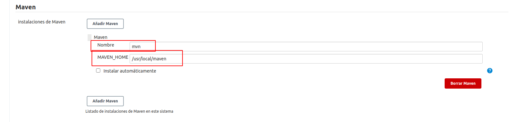

# JENKINSFILES PROJECT

# Prerequisitos

- Configurar nodos con etiquetas "bash" y "bash2"


- Para el error que se presenta al configurar el nodo con ssh, verificar que se encuentre la dirección del nombre de la maquina en el archivo known_hosts, de no ser así, agregarlos, una forma es conectarse directo vía ssh y nos saldra la opción de realizarlo. 

    Otra forma es mediante el comando 
    ```bash
    ssh-keyscan -H <HOSTNAME> >> ~/.ssh/known_hosts 
    ```
    Este comando agrega el **fingerprint** del host.

- Cuando el nodo sea configurado con private key, a parte de que debe estar en known_hosts debemos verificar que este en el archivo **authorized_keys** la parte publica de la llave.


# Ejecución de MAVEN

- Se ha tenido que realizar las siguientes configuraciones para poder utilizar los comandos **mvn**

    - Dar de alta en la opción **Global Tool Configuration** la instalación de maven.
    
    - Considerar el nombre ya que se utilizara despues.
    - El **Path** debe ser hasta antes de **bin/mvn**
    - En el pipeline se utilizara la siguiente opción.

        ```bash
        tools {
            maven '<nombre que se le dió a la instalción>'
        }
        ```  
    - Otra opción es la siguiente:
        ```bash
            node{
            stage('init'){
            //init sample
            }
            stage('build'){
                withMaven(maven: 'mvn') {
                    sh "mvn clean package"
                }
            }
        }
        ```

# Referencias

- [Host Key Verification for SSH Agents
](https://support.cloudbees.com/hc/en-us/articles/115000073552-Host-Key-Verification-for-SSH-Agents)